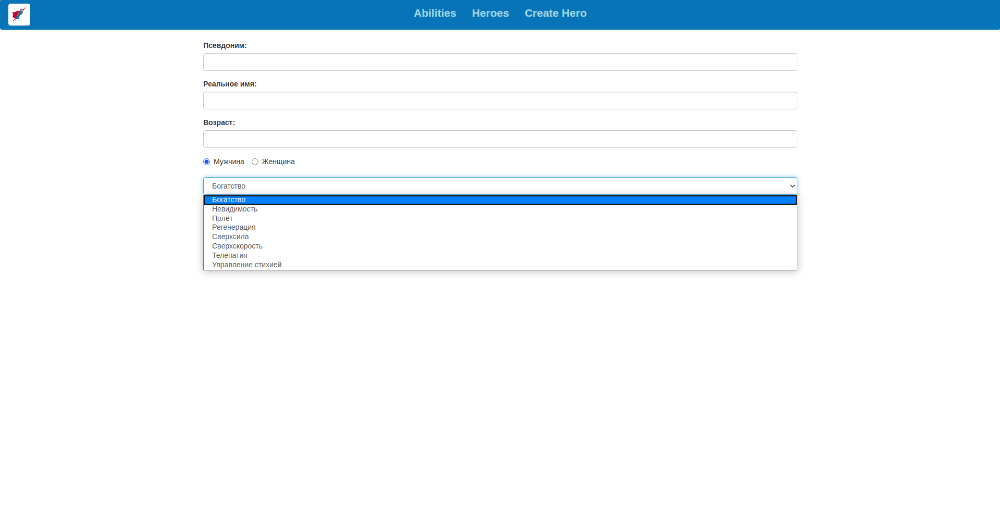

= JSTL

Дана система для хранения информации о супергероях. Реализовать *Presentation Layer* для данной системы.

WARNING: При выполнении работы, не следует в точности следовать дизайну страниц из макетов, но необходимо реализовать представленную на них функциональность.

Перед началом работы:

* Запустить скрипт `jstl.sql` в `resources/sql` проекта.

[source,sql]
----
include::sql/jstl.sql[Heroes SQL script]
----

* Ознакомиться с содержимым проекта, обратить внимание на пакеты `service` и `dto`. В них находятся классы, необходимые для работы с данными из servlets. Для работы с данными о героях/способностях предоставлены сервисы `HeroService` и `AbilityService`.

== Task 1

Создать страницу просмотра списка супергеройских способностей, для этого использовать макет:

== Task 2

Создать страницу просмотра списка супергероев, для этого использовать нижеприведенный макет, где имя каждого героя - это ссылка, ведущая на страницу полной информации о герое.

== Task 2

Создать страницу с полной информацией о герое, переход на которую осуществляется при клике по ссылке из предыдущего пункта.
Для этого использовать макет:

== Task 3

Создать страницу с формой сохранения героя. Для этого использовать макет:

* `gender` героя выбирается с помощью `<input type="radio">`
* `ability` героя выбирается с помощью `<select>`
